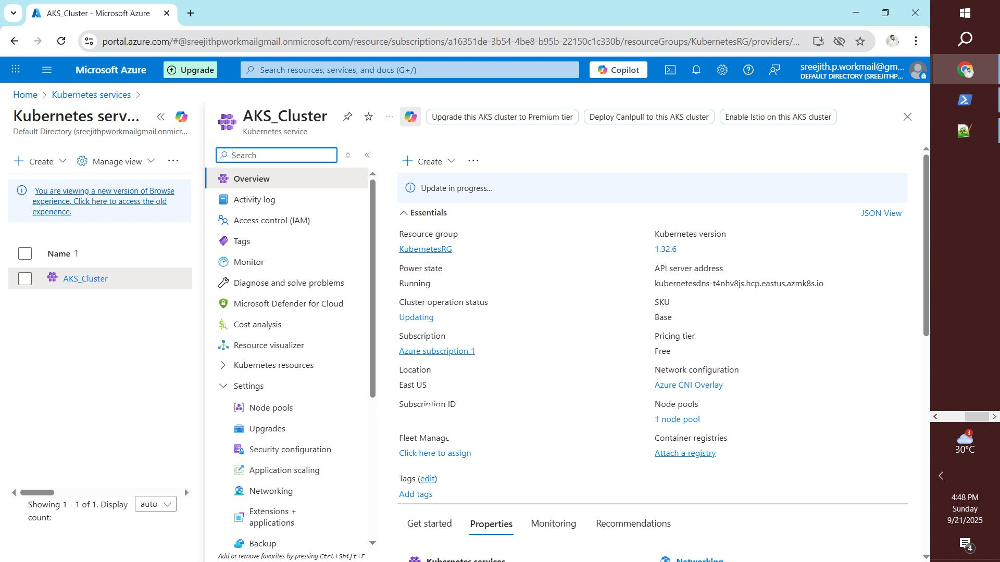
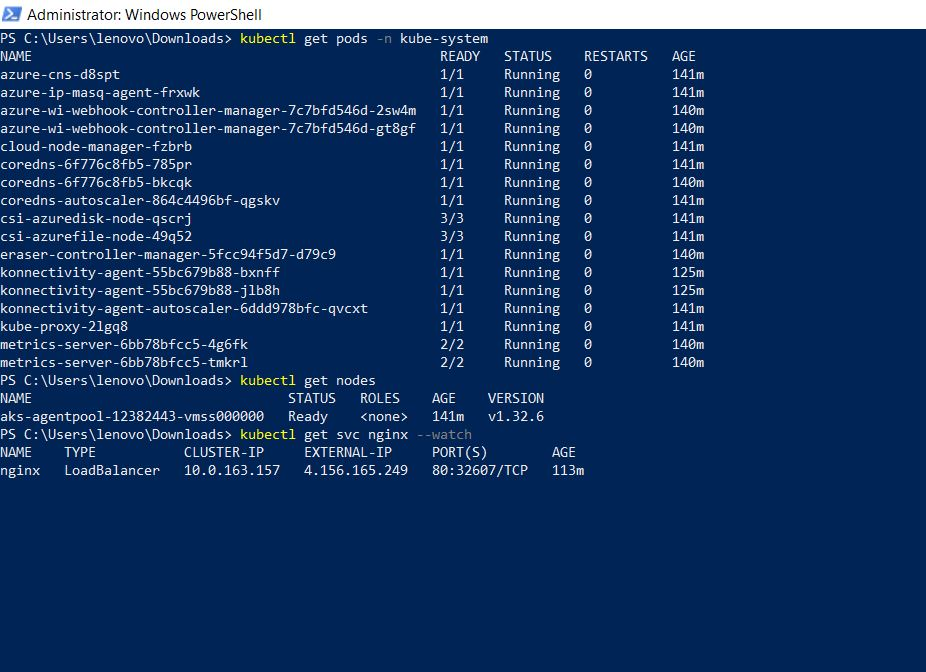
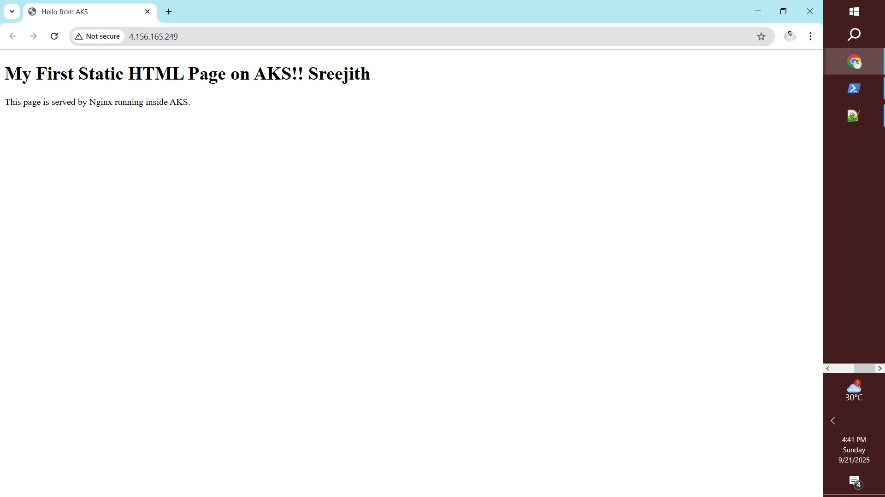
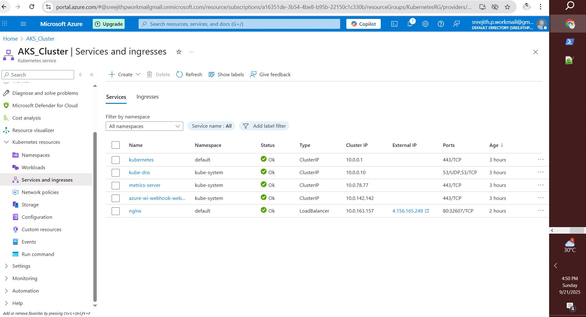
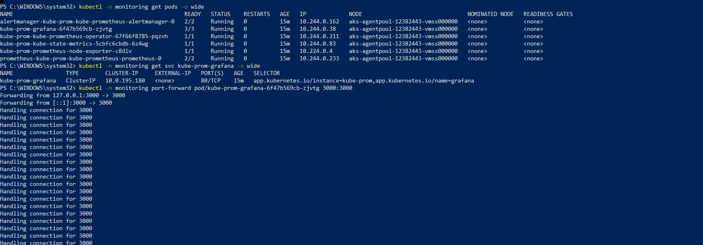
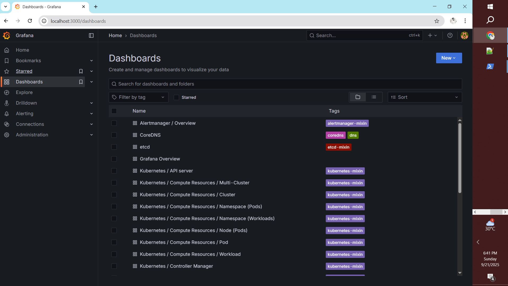
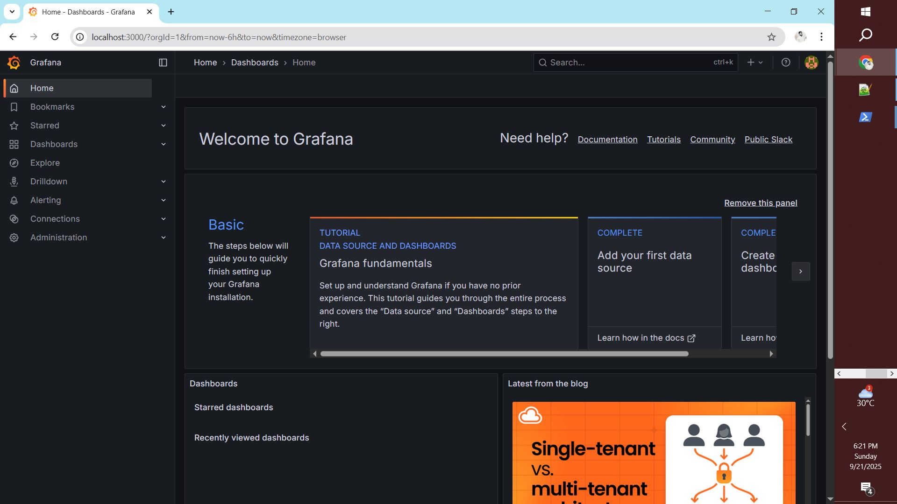

# Azure Kubernetes Setup Guide

Test setup of an Azure Kubernetes Service (AKS) cluster, including Nginx deployment, Helm, Prometheus, and Grafana. Screenshots are provided for each steps.

---


## Table of Contents

- [Azure Login & Cluster Context](#azure-login--cluster-context)
- [Namespace Management](#namespace-management)
- [Node & Pod Management](#node--pod-management)
- [Nginx Deployment](#nginx-deployment)
- [Network Security Group (NSG) Configuration](#network-security-group-nsg-configuration)
- [Helm Installation](#helm-installation)
- [Prometheus & Grafana Setup](#prometheus--grafana-setup)
- [Accessing Grafana](#accessing-grafana)
- [Screenshots](#screenshots)

---

## Azure Login & Cluster Context

Login to Azure:

```sh
az login --use-device-code
```

List available clusters:

```sh
kubectl config get-contexts
```

Set current namespace:

```sh
kubectl config set-context --current --namespace=monitoring
```

List all namespaces:

```sh
kubectl get namespaces
```

---

## Namespace Management

Create a new namespace:

```sh
kubectl create namespace dev
```

List namespaces:

```sh
kubectl get namespaces
```

---

## Node & Pod Management

List nodes:

```sh
kubectl get nodes
```

List pods in kube-system namespace:

```sh
kubectl get pods -n kube-system
```

Get cluster status and info:

```sh
kubectl get cs
kubectl cluster-info
```

---

## Nginx Deployment

Create and expose Nginx deployment:

```sh
kubectl create deployment nginx --image=nginx
kubectl expose deployment nginx --port=80 --type=LoadBalancer
kubectl get svc nginx --watch
```

Copy your HTML file to the Nginx pod:

```sh
kubectl cp index.html nginx-<pod-id>:/usr/share/nginx/html/index.html
```

---

## Network Security Group (NSG) Configuration

To restrict access to Nginx, configure NSG rules:

- **Source IP**: Your laptop’s public IP (use `***.***.***.***/32`)
- **Destination**: Any
- **Service**: Custom
- **Destination Port**: 80
- **Protocol**: TCP
- **Action**: Allow
- **Priority**: Lower than default deny rule (e.g., 400)
- **Name**: Allow-HTTP-MyIP

Example Azure CLI command (mask your IP):

```sh
az aks update \
  --resource-group KubernetesRG \
  --name AKS_Cluster \
  --api-server-authorized-ip-ranges ***.***.***.***/32
```

---

## Helm Installation

Install Helm (PowerShell):

```powershell
$version="v3.15.4"
$url="https://get.helm.sh/helm-$version-windows-amd64.zip"
$out="$env:TEMP\helm-$version.zip"
$extract="$env:TEMP\helm-$version"
$install="C:\Program Files\helm"

Invoke-WebRequest -Uri $url -OutFile $out
Expand-Archive -Path $out -DestinationPath $extract -Force
if (-not (Test-Path $install)) { New-Item -Path $install -ItemType Directory | Out-Null }
Move-Item -Path (Join-Path $extract "windows-amd64\helm.exe") -Destination (Join-Path $install "helm.exe") -Force
$mp = [Environment]::GetEnvironmentVariable("Path","Machine"); if ($mp -notlike "*$install*") {[Environment]::SetEnvironmentVariable("Path",$mp + ";" + $install,"Machine")}
helm version
```

---

## Prometheus & Grafana Setup using kube-prom

Create monitoring namespace and install Prometheus/Grafana stack:

```sh
kubectl create namespace monitoring
helm repo add prometheus-community https://prometheus-community.github.io/helm-charts
helm repo update
helm install kube-prom prometheus-community/kube-prometheus-stack -n monitoring
```

List monitoring pods:

```sh
kubectl get pods -n monitoring
kubectl -n monitoring get pods -o wide
kubectl -n monitoring get svc kube-prom-grafana -o wide
```

---

## Accessing Grafana

Port-forward Grafana pod to local machine:

```sh
kubectl -n monitoring port-forward pod/kube-prom-grafana-<pod-id> 3000:3000
```

Open Grafana in browser:

```
http://localhost:3000
```

Login credentials:

- **Username**: admin
- **Password**: Retrieve and decode with:

```sh
kubectl get secret -n monitoring kube-prom-grafana -o jsonpath="{.data.admin-password}"
```

Decode (PowerShell):

```powershell
[System.Text.Encoding]::UTF8.GetString([System.Convert]::FromBase64String($secret))
```

---

## Screenshots

### Cluster Overview

<!-- Shows the AKS cluster details in Azure Portal, including services, ingresses, and cluster IPs. Useful for visualizing cluster resources and service endpoints. -->

### Node & Pod Management

<!-- Displays the output of `kubectl get nodes` and `kubectl get pods -n kube-system`, showing node status and system pods running in the cluster. -->


<!-- Shows the Grafana pod running in the monitoring namespace, confirming successful deployment of monitoring stack. -->

### Nginx & HTML Deployment

<!-- Demonstrates a custom static HTML page served by Nginx running inside AKS, accessed via the external LoadBalancer IP. -->

### Network & Ingress

<!-- Displays Azure Portal's Services and Ingresses view, showing service types, external IPs, and port mappings for cluster services. -->


<!-- Shows PowerShell output of port-forwarding Grafana pod to localhost, enabling local access to Grafana UI for dashboard management. -->

### Grafana Dashboard

<!-- Displays Grafana's default dashboard page, confirming successful setup and access to monitoring dashboards. -->


<!-- Shows the Grafana dashboard list, including Kubernetes and Alertmanager dashboards, used for cluster monitoring and visualization. -->

